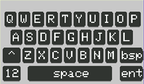
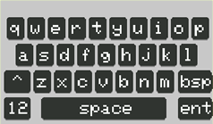
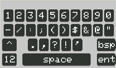

# Simple Touch Keyboard
A simple touch keyboard designed for low-resolution displays.  Ideal for small TFT displays (240×320) and AVR MCUs (Arduino Uno R3). 
Optimized for ILI9341 display + XPT2046 touch panel. 
Supports multiple layouts, repeating backspace, and screen rotation.

## Overview

This project provides a lightweight, easy-to-use touch keyboard implementation optimized for devices with limited screen real estate. It's particularly well-suited for embedded systems, IoT devices, and small displays where traditional on-screen keyboards may be too complex or resource-intensive.

## Features

-   **Low-resolution optimized**: Designed specifically for displays with limited pixel density
-   **Lightweight**: Minimal resource footprint
-   **Simple implementation**: Easy to integrate into existing projects
-   **Touch-friendly**: Optimized for touch input interfaces

| upper-alpha | lower-alpha |
| :---: | :---: |
|  |  |
| numeric | symbol |
|  |  |

## Detail
For projects in need of alpha-numeric user input via touch panel on smaller lightweight MCUs, this project demonstrates a fully functioning keyboard similar to those presented by mobile devices, and offers a means to get user input to their application. 

For the majority of MCU-controlled touch displays, the LvGL Library is a common solution to present graphical user interfaces and, where needed, the alpha-numeric touch keyboard. But the memory and speed requirements for LvGL exceed those of the more lightweight MCU, such as the Arduino Uno R3, with its limited speed and memory.  Smaller MCUs are limited in the display resolution they can realistically operate.  

Using smaller color displays, such as the 240x320 TFT LCD supported by the ILI9341 and ST7789 display driver ICs, the limited resolution can provide challenges presenting the fully functional alpha-numeric keyboard. 

As with any software solution, "there is more than one way to skin a cat." This project simply presents one method to resolve the issue, and may help the consumer know what is possible, and give them a head-start when in need of user keyboard input.

## Usage

Explore the `examples/` directory for sample implementations demonstrating how to integrate the keyboard into your project.

## License

This project is licensed under the GNU General Public License v3.0 - see the [LICENSE](https://claude.ai/chat/LICENSE) file for details.
